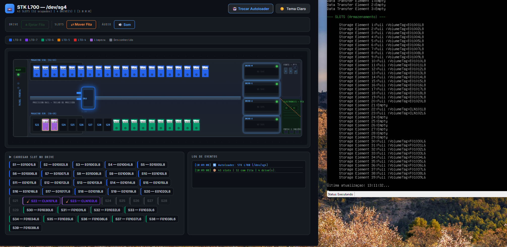
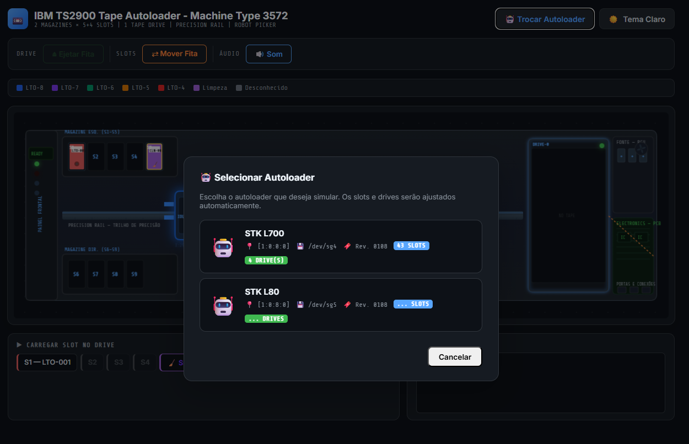
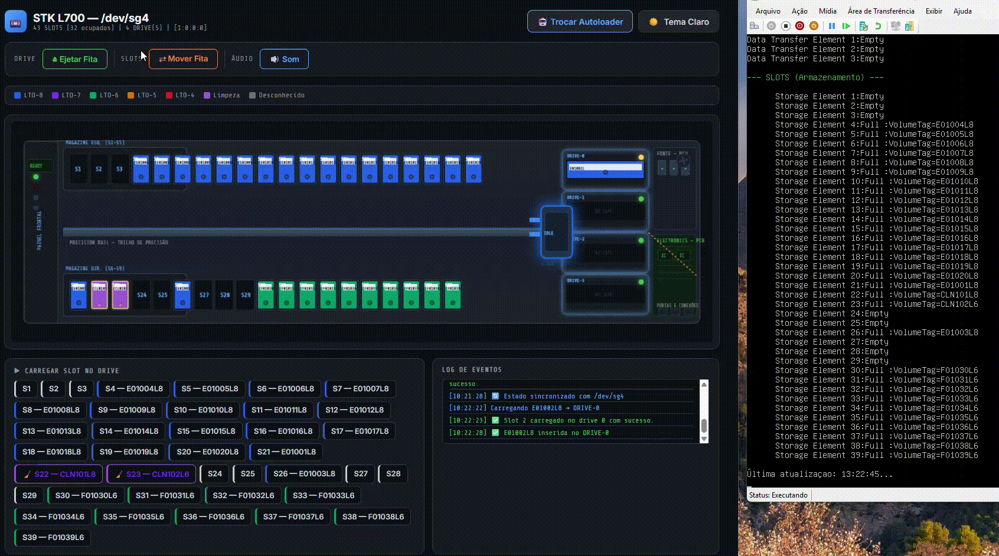
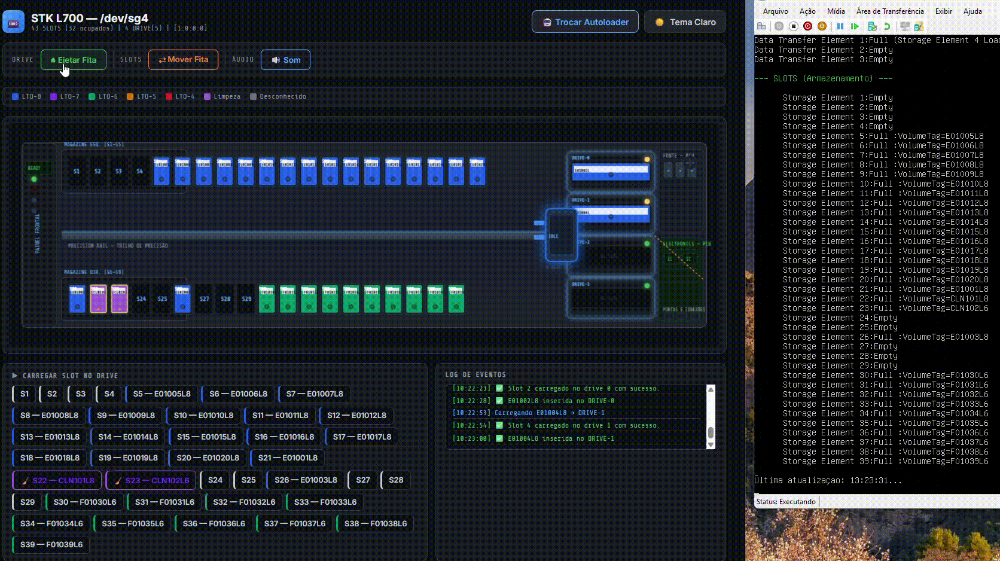
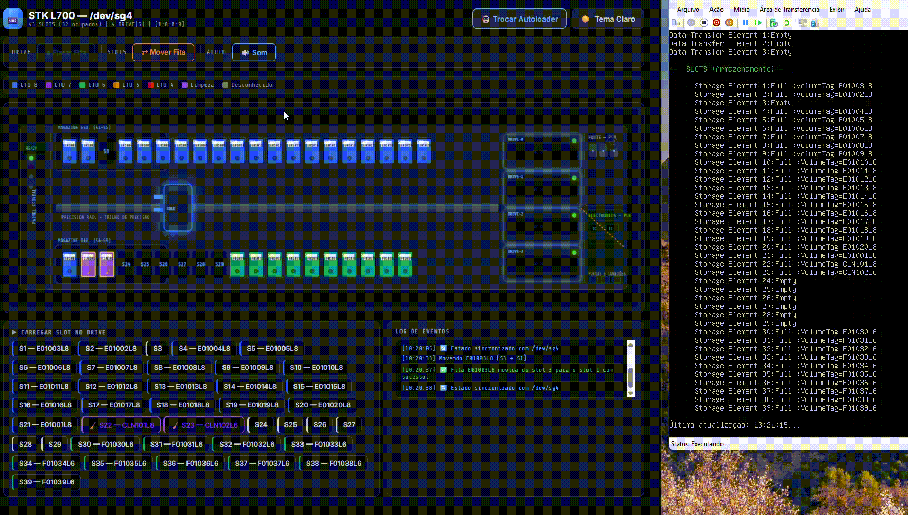

# 🤖 Tapebot

Sistema web para **controle e automação de autoloaders de fita (tape libraries)**, incluindo equipamentos antigos sem suporte oficial.

---

## 🧠 Sobre o projeto

O **Tapebot** foi criado para resolver um problema comum em ambientes corporativos:

> Equipamentos de backup antigos ainda funcionam perfeitamente, mas **perderam suporte da fabricante** e não possuem integração com ferramentas modernas (como Proxmox).

Com isso, tarefas simples como **movimentar fitas entre slots e drivers** se tornam difíceis ou impossíveis via software.

👉 O Tapebot resolve isso permitindo **controle total do robô via interface web**, mesmo em equipamentos com mais de 10 anos de uso.

### 💡 Exemplo real testado

* IBM System Storage TS2900 (Machine Type 3572)

---

## 🚀 Demonstração

### 🎛️ Simulador + Monitoramento em tempo real



O simulador web interage diretamente com o autoloader e exibe, em tempo real, a animação das movimentações realizadas pelo robô.
O script de monitoramento atua como ferramenta auxiliar para visualização do estado do equipamento.

---

### 🧭 Seleção de autoloaders



Lista automaticamente os dispositivos detectados.

---

### 🎬 Movimentação de fitas (visual)

#### ➡️ Colocando fita no driver



---

#### ⬅️ Ejetando fita do driver



---

#### 🔄 Movendo fita entre slots



---

## ⚙️ Funcionalidades

* 📊 Representação visual completa do autoloader

  * Slots disponíveis
  * Fitas inseridas
  * Drivers

* 🎮 Controle manual do robô

  * Mover fita entre slots
  * Inserir fita no driver
  * Ejetar fita do driver

* 📡 Monitoramento em tempo real via script bash

---

## 🧱 Tecnologias utilizadas

* **Frontend**

  * HTML + Canvas
  * JavaScript

* **Backend**

  * PHP puro

* **Infraestrutura**

  * SSH para execução remota de comandos
  * Bash script para monitoramento

---

## 📁 Estrutura do projeto

```bash
/simulador      → interface web (HTML, CSS, JS)
/api            → backend PHP (controle do autoloader)
/config         → configuração de acesso SSH
/script         → monitoramento via bash
/prints         → imagens e gifs de demonstração
```

---

## ▶️ Como executar o projeto

### 🔹 Requisitos

* PHP 8.5.4 ou superior
* Servidor com acesso ao autoloader
* Acesso SSH configurado

---

### 🔹 Configuração

Edite o arquivo:

```bash
/config/ssh.php
```

Defina:

```php
SSH_HOST  → IP do servidor conectado ao autoloader
SSH_USER  → usuário SSH
SSH_KEY   → chave privada
```

---

### 🔹 Executar

Inicie o servidor PHP:

```bash
php -S localhost:8000
```

Acesse no navegador:

```
http://localhost:8000
```

---

## 🖥️ Monitoramento via script

O script `monitor_autoloader.sh` permite acompanhar em tempo real o estado do robô.

### 🔹 Uso:

```bash
./monitor_autoloader -f {dispositivo} -all
```

Mostra todos os slots e drivers

```bash
./monitor_autoloader -f {dispositivo} -d
```

Mostra apenas os drivers

```bash
./monitor_autoloader -f {dispositivo} -s
```

Mostra apenas os slots

---

## 💡 Diferenciais

* ♻️ **Recupera equipamentos antigos**

  * Permite reutilizar autoloaders sem suporte

* 🔌 **Independente de fabricante**

  * Funciona mesmo sem software oficial

* 🧠 **Interface visual intuitiva**

  * Representação fiel do hardware

* ⚡ **Tempo real**

  * Integração direta com o sistema via SSH

---

## 📄 Licença

Este projeto está sob a licença MIT.
Você pode usar, modificar e distribuir livremente, inclusive para fins comerciais, desde que mantenha a licença original e os créditos do autor.
